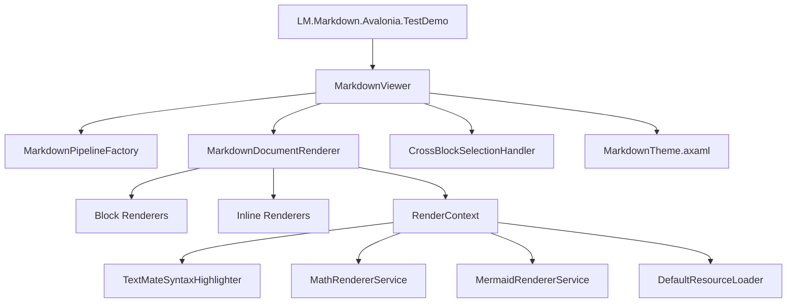
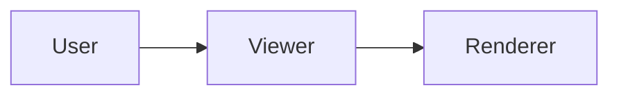

# LM.Markdown.Avalonia

LM.Markdown.Avalonia is an Avalonia markdown rendering control built for desktop applications that need rich markdown display, incremental streaming updates, syntax-highlighted code blocks, math formulas, tables, task lists, image loading, and Mermaid diagram rendering.

For the Simplified Chinese version of this document, see [doc/README-ZH.md](doc/README-ZH.md).

## Repository Overview

This repository contains a reusable markdown control library and a runnable demo application.

- `LM.Markdown.Avalonia/`: library project containing the markdown control, parsers, renderers, services, and theme resources.
- `LM.Markdown.Avalonia.TestDemo/`: Avalonia desktop demo application used to verify rendering and interaction behavior.
- `reference/`: earlier reference implementation retained for comparison and migration.

## Key Features

- Markdown block and inline rendering based on Markdig.
- Incremental append rendering through `AppendMarkdown`.
- Code block syntax highlighting.
- Math formula rendering for inline and block expressions.
- Mermaid diagram rendering.
- Image loading with cache control and cancellation support.
- Unified cross-block text selection and auto-scroll support.
- Light and dark theme resources.

## Repository Architecture



Architecture notes:

- `MarkdownViewer` is the control entry point and manages visual tree creation, full rendering, incremental appends, auto-scroll, and selection lifecycle.
- `MarkdownPipelineFactory` creates the Markdig parsing pipeline.
- `MarkdownDocumentRenderer` coordinates block and inline renderers and writes source span mapping into `RenderContext`.
- Service abstractions isolate syntax highlighting, math rendering, Mermaid rendering, and resource loading.
- `MarkdownTheme.axaml` provides shared typography, spacing, and light/dark color resources.

## Recent Update

- Added Mermaid diagram rendering support for fenced `mermaid` code blocks.
- Fixed memory retention caused by rendering cache and stale control references during detach and rerender paths.
- Added cancellation and bounded cache behavior to resource-heavy services.


## Getting Started

### 1. Reference the library

If you are working inside the solution, add a project reference:

```xml
<ItemGroup>
  <ProjectReference Include="..\LM.Markdown.Avalonia\LM.Markdown.Avalonia.csproj" />
</ItemGroup>
```

### 2. Merge theme resources

Add the markdown theme into your `App.axaml` resources:

```xml
<Application.Resources>
  <ResourceDictionary>
    <ResourceDictionary.MergedDictionaries>
      <ResourceInclude Source="avares://LM.Markdown.Avalonia/Themes/MarkdownTheme.axaml" />
    </ResourceDictionary.MergedDictionaries>
  </ResourceDictionary>
</Application.Resources>
```

### 3. Place the control in XAML

```xml
<Window xmlns="https://github.com/avaloniaui"
        xmlns:x="http://schemas.microsoft.com/winfx/2006/xaml"
        xmlns:md="clr-namespace:LM.Markdown.Avalonia.Controls;assembly=LM.Markdown.Avalonia"
        x:Class="Demo.MainWindow">

  <md:MarkdownViewer x:Name="MarkdownViewer"
                     Margin="16"
                     AutoScroll="True"
                     EnableUnifiedSelection="True" />
</Window>
```

### 4. Set markdown content in code

```csharp
using Avalonia.Controls;
using LM.Markdown.Avalonia.Controls;

namespace Demo;

public partial class MainWindow : Window
{
    public MainWindow()
    {
        InitializeComponent();

        var viewer = this.FindControl<MarkdownViewer>("MarkdownViewer")!;
        viewer.Markdown = """
# Hello LM.Markdown.Avalonia

This control supports **markdown**, tables, math, code blocks, and Mermaid.


""";
    }
}
```

### 5. Stream markdown progressively

```csharp
viewer.ClearMarkdown();
viewer.AppendMarkdown("# Streaming");
viewer.AppendMarkdown("\n\nFirst chunk.");
viewer.AppendMarkdown("\n\nSecond chunk.");
```

## Simple Usage

For a complete runnable application, see `LM.Markdown.Avalonia.TestDemo`.

Minimal XAML:

```xml
<Window xmlns="https://github.com/avaloniaui"
        xmlns:x="http://schemas.microsoft.com/winfx/2006/xaml"
        xmlns:md="clr-namespace:LM.Markdown.Avalonia.Controls;assembly=LM.Markdown.Avalonia"
        x:Class="Demo.MainWindow">

  <md:MarkdownViewer x:Name="MarkdownViewer" Margin="16" />
</Window>
```

Minimal code-behind:

```csharp
using Avalonia.Controls;
using LM.Markdown.Avalonia.Controls;

namespace Demo;

public partial class MainWindow : Window
{
    public MainWindow()
    {
        InitializeComponent();

        var viewer = this.FindControl<MarkdownViewer>("MarkdownViewer")!;
        viewer.Markdown = "# Hello\n\nThis is **LM.Markdown.Avalonia**.";
    }
}
```

## Run the Demo

```powershell
dotnet run --project .\LM.Markdown.Avalonia.TestDemo\LM.Markdown.Avalonia.TestDemo.csproj
```

## Development Notes

- The library currently targets `.NET 10` and Avalonia `11.3.x`.
- The default implementation wires in `TextMateSyntaxHighlighter`, `DefaultResourceLoader`, `MathRendererService`, and `MermaidRendererService` automatically.
- When hosting the control in a long-lived or streaming UI, use `ClearMarkdown` before starting a new stream.
