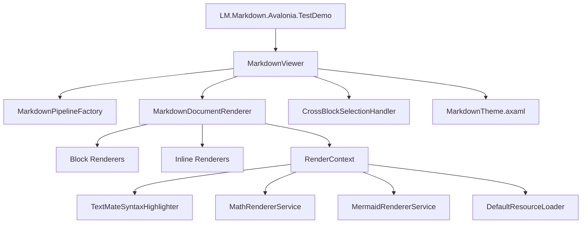
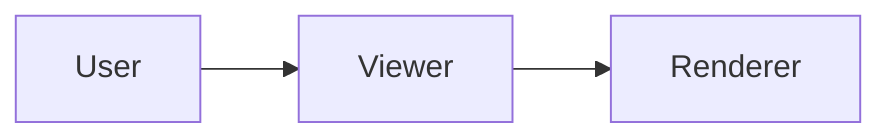
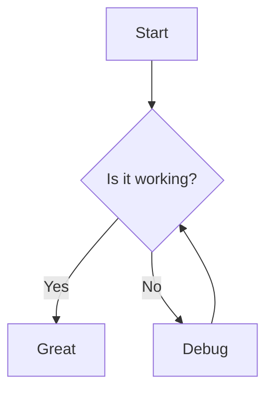

# LM.Markdown.Avalonia

LM.Markdown.Avalonia is an Avalonia markdown rendering control built for desktop applications that need rich markdown display, incremental streaming updates, syntax-highlighted code blocks, math formulas, tables, task lists, image loading, and Mermaid diagram rendering.

LM.Markdown.Avalonia 是一个面向 Avalonia 桌面应用的 Markdown 渲染控件，适合需要富文本 Markdown 展示、增量流式输出、代码高亮、数学公式、表格、任务列表、图片加载和 Mermaid 图表渲染的场景。

## Repository Overview | 仓库说明

This repository contains a reusable markdown control library and a runnable demo application.

本仓库包含一个可复用的 Markdown 控件库，以及一个可直接运行的演示程序。

- `LM.Markdown.Avalonia/`: library project containing the markdown control, parsers, renderers, services, and theme resources.
- `LM.Markdown.Avalonia.TestDemo/`: Avalonia desktop demo application used to verify rendering and interaction behavior.
- `reference/`: earlier reference implementation retained for comparison and migration.

- `LM.Markdown.Avalonia/`：控件库项目，包含 Markdown 控件、解析管线、渲染器、服务和主题资源。
- `LM.Markdown.Avalonia.TestDemo/`：Avalonia 桌面 Demo，用于验证渲染和交互行为。
- `reference/`：历史参考实现，用于对照和迁移。

## Key Features | 核心能力

- Markdown block and inline rendering based on Markdig.
- Incremental append rendering through `AppendMarkdown`.
- Code block syntax highlighting.
- Math formula rendering for inline and block expressions.
- Mermaid diagram rendering.
- Image loading with cache control and cancellation support.
- Unified cross-block text selection and auto-scroll support.
- Light and dark theme resources.

- 基于 Markdig 的块级和行内 Markdown 渲染。
- 通过 `AppendMarkdown` 实现流式追加渲染。
- 代码块语法高亮。
- 行内与块级数学公式渲染。
- Mermaid 图表渲染。
- 带缓存控制和取消能力的图片加载。
- 跨块文本统一选择与自动滚动。
- 明暗主题资源支持。

## Repository Architecture | 仓库架构



Architecture notes:

- `MarkdownViewer` is the control entry point and manages visual tree creation, full rendering, incremental appends, auto-scroll, and selection lifecycle.
- `MarkdownPipelineFactory` creates the Markdig parsing pipeline.
- `MarkdownDocumentRenderer` coordinates block and inline renderers and writes source span mapping into `RenderContext`.
- Service abstractions isolate syntax highlighting, math rendering, Mermaid rendering, and resource loading.
- `MarkdownTheme.axaml` provides shared typography, spacing, and light/dark color resources.

架构说明：

- `MarkdownViewer` 是控件入口，负责可视树创建、全量渲染、增量追加、自动滚动和选择生命周期。
- `MarkdownPipelineFactory` 负责创建 Markdig 解析管线。
- `MarkdownDocumentRenderer` 负责组织块级和行内渲染器，并将源码映射写入 `RenderContext`。
- 各类服务接口用于隔离代码高亮、数学公式、Mermaid 渲染和资源加载。
- `MarkdownTheme.axaml` 提供统一的排版、间距和明暗主题资源。

## Recent Update | 本次更新

- Added Mermaid diagram rendering support for fenced `mermaid` code blocks.
- Fixed memory retention caused by rendering cache and stale control references during detach and rerender paths.
- Added cancellation and bounded cache behavior to resource-heavy services.

- 新增围栏代码块 `mermaid` 图表渲染支持。
- 修复渲染缓存与旧控件引用在控件卸载和重新渲染路径上的内存滞留问题。
- 为资源密集型服务补充取消机制和有界缓存行为。

## Getting Started | 使用方法

### 1. Reference the library | 引用库项目

If you are working inside the solution, add a project reference:

如果你在当前解决方案内使用，直接添加项目引用：

```xml
<ItemGroup>
  <ProjectReference Include="..\LM.Markdown.Avalonia\LM.Markdown.Avalonia.csproj" />
</ItemGroup>
```

### 2. Merge theme resources | 合并主题资源

Add the markdown theme into your `App.axaml` resources:

在 `App.axaml` 中合并 Markdown 主题资源：

```xml
<Application.Resources>
  <ResourceDictionary>
    <ResourceDictionary.MergedDictionaries>
      <ResourceInclude Source="avares://LM.Markdown.Avalonia/Themes/MarkdownTheme.axaml" />
    </ResourceDictionary.MergedDictionaries>
  </ResourceDictionary>
</Application.Resources>
```

### 3. Place the control in XAML | 在 XAML 中放置控件

```xml
<Window xmlns="https://github.com/avaloniaui"
        xmlns:x="http://schemas.microsoft.com/winfx/2006/xaml"
        xmlns:md="clr-namespace:LM.Markdown.Avalonia.Controls;assembly=LM.Markdown.Avalonia"
        x:Class="Demo.MainWindow">

  <md:MarkdownViewer x:Name="MarkdownViewer"
                     Margin="16"
                     AutoScroll="True"
                     EnableUnifiedSelection="True" />
</Window>
```

### 4. Set markdown content in code | 在代码中设置 Markdown 内容

```csharp
using Avalonia.Controls;
using LM.Markdown.Avalonia.Controls;

namespace Demo;

public partial class MainWindow : Window
{
    public MainWindow()
    {
        InitializeComponent();

        var viewer = this.FindControl<MarkdownViewer>("MarkdownViewer")!;
        viewer.Markdown = """
# Hello LM.Markdown.Avalonia

This control supports **markdown**, tables, math, code blocks, and Mermaid.


""";
    }
}
```

### 5. Stream markdown progressively | 流式追加 Markdown

```csharp
viewer.ClearMarkdown();
viewer.AppendMarkdown("# Streaming");
viewer.AppendMarkdown("\n\nFirst chunk.");
viewer.AppendMarkdown("\n\nSecond chunk.");
```

## Demo Example | 控件示例演示代码

The repository already contains a runnable demo in `LM.Markdown.Avalonia.TestDemo`.

仓库已内置可运行的 Demo，位于 `LM.Markdown.Avalonia.TestDemo`。

### Demo XAML

```xml
<Window xmlns="https://github.com/avaloniaui"
        xmlns:x="http://schemas.microsoft.com/winfx/2006/xaml"
        xmlns:d="http://schemas.microsoft.com/expression/blend/2008"
        xmlns:mc="http://schemas.openxmlformats.org/markup-compatibility/2006"
        xmlns:md="clr-namespace:LM.Markdown.Avalonia.Controls;assembly=LM.Markdown.Avalonia"
        mc:Ignorable="d"
        x:Class="LM.Markdown.Avalonia.TestDemo.MainWindow"
        Title="LM.Markdown.Avalonia - Demo"
        Width="1000"
        Height="700">

    <DockPanel Margin="0">
        <DockPanel DockPanel.Dock="Top" Margin="12,8">
            <TextBlock Text="LM.Markdown.Avalonia Demo"
                       FontSize="16"
                       FontWeight="Bold"
                       VerticalAlignment="Center" />
            <StackPanel Orientation="Horizontal" HorizontalAlignment="Right" Spacing="8">
                <Button x:Name="BtnStatic" Content="Static Render" />
                <Button x:Name="BtnStream" Content="Streaming Demo" />
                <Button x:Name="BtnClear" Content="Clear" />
                <ToggleSwitch x:Name="ThemeToggle" Content="Dark" OffContent="Light" OnContent="Dark" />
            </StackPanel>
        </DockPanel>

        <Border BorderThickness="0,1,0,0" BorderBrush="#E0E2E6">
            <md:MarkdownViewer x:Name="MdViewer" Margin="16" />
        </Border>
    </DockPanel>
</Window>
```

### Demo Code-Behind

```csharp
using Avalonia;
using Avalonia.Controls;
using Avalonia.Styling;
using Avalonia.Threading;
using LM.Markdown.Avalonia.Controls;

namespace LM.Markdown.Avalonia.TestDemo;

public partial class MainWindow : Window
{
    private CancellationTokenSource? _streamCts;

    private const string SampleMarkdown = """
# LM.Markdown.Avalonia Demo

This demo shows code blocks, math, images, tables, task lists, and Mermaid diagrams.


""";

    public MainWindow()
    {
        InitializeComponent();

        var btnStatic = this.FindControl<Button>("BtnStatic")!;
        var btnStream = this.FindControl<Button>("BtnStream")!;
        var btnClear = this.FindControl<Button>("BtnClear")!;
        var themeToggle = this.FindControl<ToggleSwitch>("ThemeToggle")!;
        var mdViewer = this.FindControl<MarkdownViewer>("MdViewer")!;

        btnStatic.Click += (_, _) =>
        {
            CancelStream();
            mdViewer.Markdown = SampleMarkdown;
        };

        btnStream.Click += (_, _) =>
        {
            CancelStream();
            _ = StreamMarkdownAsync(mdViewer);
        };

        btnClear.Click += (_, _) =>
        {
            CancelStream();
            mdViewer.ClearMarkdown();
        };

        themeToggle.IsCheckedChanged += (_, _) =>
        {
            RequestedThemeVariant = themeToggle.IsChecked == true
                ? ThemeVariant.Dark
                : ThemeVariant.Light;
        };

        mdViewer.Markdown = SampleMarkdown;
    }

    private async Task StreamMarkdownAsync(MarkdownViewer viewer)
    {
        _streamCts = new CancellationTokenSource();
        var cancellationToken = _streamCts.Token;

        viewer.ClearMarkdown();

        foreach (var chunk in SplitIntoChunks(SampleMarkdown, 12))
        {
            if (cancellationToken.IsCancellationRequested)
                break;

            await Dispatcher.UIThread.InvokeAsync(() => viewer.AppendMarkdown(chunk));
            await Task.Delay(50, cancellationToken).ConfigureAwait(false);
        }
    }

    private void CancelStream()
    {
        _streamCts?.Cancel();
        _streamCts?.Dispose();
        _streamCts = null;
    }

    private static IEnumerable<string> SplitIntoChunks(string text, int chunkSize)
    {
        for (var index = 0; index < text.Length; index += chunkSize)
        {
            yield return text.Substring(index, Math.Min(chunkSize, text.Length - index));
        }
    }
}
```

## Run the Demo | 运行演示程序

```powershell
dotnet run --project .\LM.Markdown.Avalonia.TestDemo\LM.Markdown.Avalonia.TestDemo.csproj
```

## Development Notes | 开发说明

- The library currently targets `.NET 10` and Avalonia `11.3.x`.
- The default implementation wires in `TextMateSyntaxHighlighter`, `DefaultResourceLoader`, `MathRendererService`, and `MermaidRendererService` automatically.
- When hosting the control in a long-lived or streaming UI, use `ClearMarkdown` before starting a new stream.

- 当前库面向 `.NET 10` 与 Avalonia `11.3.x`。
- 默认构造函数会自动接入 `TextMateSyntaxHighlighter`、`DefaultResourceLoader`、`MathRendererService` 和 `MermaidRendererService`。
- 在长生命周期或流式输出场景下，开始新一轮输出前建议先调用 `ClearMarkdown`。