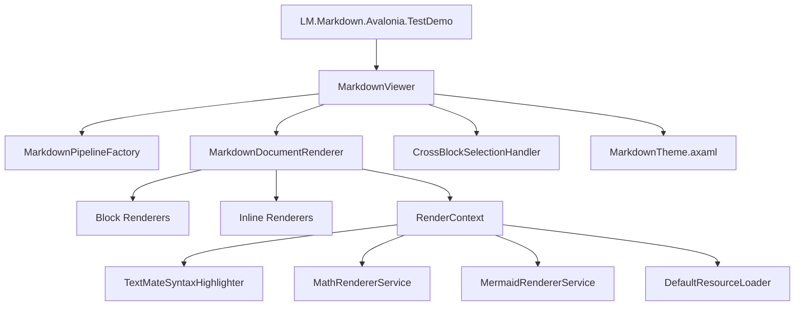

# LM.Markdown.Avalonia

LM.Markdown.Avalonia 是一个面向 Avalonia 桌面应用的 Markdown 渲染控件，适合需要富文本 Markdown 展示、增量流式输出、代码高亮、数学公式、表格、任务列表、图片加载和 Mermaid 图表渲染的场景。

如需英文版说明，请查看 [README.md](../README.md)。

## 仓库说明

本仓库包含一个可复用的 Markdown 控件库，以及一个可直接运行的演示程序。

- `LM.Markdown.Avalonia/`：控件库项目，包含 Markdown 控件、解析管线、渲染器、服务和主题资源。
- `LM.Markdown.Avalonia.TestDemo/`：Avalonia 桌面 Demo，用于验证渲染和交互行为。
- `reference/`：历史参考实现，用于对照和迁移。

## 核心能力

- 基于 Markdig 的块级和行内 Markdown 渲染。
- 通过 `AppendMarkdown` 实现流式追加渲染。
- 代码块语法高亮。
- 行内与块级数学公式渲染。
- Mermaid 图表渲染。
- 带缓存控制和取消能力的图片加载。
- 跨块文本统一选择与自动滚动。
- 明暗主题资源支持。

## 仓库架构



架构说明：

- `MarkdownViewer` 是控件入口，负责可视树创建、全量渲染、增量追加、自动滚动和选择生命周期。
- `MarkdownPipelineFactory` 负责创建 Markdig 解析管线。
- `MarkdownDocumentRenderer` 负责组织块级和行内渲染器，并将源码映射写入 `RenderContext`。
- 各类服务接口用于隔离代码高亮、数学公式、Mermaid 渲染和资源加载。
- `MarkdownTheme.axaml` 提供统一的排版、间距和明暗主题资源。

## 本次更新

- 新增围栏代码块 `mermaid` 图表渲染支持。
- 修复渲染缓存与旧控件引用在控件卸载和重新渲染路径上的内存滞留问题。
- 为资源密集型服务补充取消机制和有界缓存行为。

## 使用方法

### 1. 引用库项目

如果你在当前解决方案内使用，直接添加项目引用：

```xml
<ItemGroup>
  <ProjectReference Include="..\LM.Markdown.Avalonia\LM.Markdown.Avalonia.csproj" />
</ItemGroup>
```

### 2. 合并主题资源

在 `App.axaml` 中合并 Markdown 主题资源：

```xml
<Application.Resources>
  <ResourceDictionary>
    <ResourceDictionary.MergedDictionaries>
      <ResourceInclude Source="avares://LM.Markdown.Avalonia/Themes/MarkdownTheme.axaml" />
    </ResourceDictionary.MergedDictionaries>
  </ResourceDictionary>
</Application.Resources>
```

### 3. 在 XAML 中放置控件

```xml
<Window xmlns="https://github.com/avaloniaui"
        xmlns:x="http://schemas.microsoft.com/winfx/2006/xaml"
        xmlns:md="clr-namespace:LM.Markdown.Avalonia.Controls;assembly=LM.Markdown.Avalonia"
        x:Class="Demo.MainWindow">

  <md:MarkdownViewer x:Name="MarkdownViewer"
                     Margin="16"
                     AutoScroll="True"
                     EnableUnifiedSelection="True" />
</Window>
```

### 4. 在代码中设置 Markdown 内容

```csharp
using Avalonia.Controls;
using LM.Markdown.Avalonia.Controls;

namespace Demo;

public partial class MainWindow : Window
{
    public MainWindow()
    {
        InitializeComponent();

        var viewer = this.FindControl<MarkdownViewer>("MarkdownViewer")!;
        viewer.Markdown = """
# Hello LM.Markdown.Avalonia

This control supports **markdown**, tables, math, code blocks, and Mermaid.


""";
    }
}
```

### 5. 流式追加 Markdown

```csharp
viewer.ClearMarkdown();
viewer.AppendMarkdown("# Streaming");
viewer.AppendMarkdown("\n\nFirst chunk.");
viewer.AppendMarkdown("\n\nSecond chunk.");
```

## 简单使用

完整可运行示例请查看 `LM.Markdown.Avalonia.TestDemo`。

最小 XAML 示例：

```xml
<Window xmlns="https://github.com/avaloniaui"
        xmlns:x="http://schemas.microsoft.com/winfx/2006/xaml"
        xmlns:md="clr-namespace:LM.Markdown.Avalonia.Controls;assembly=LM.Markdown.Avalonia"
        x:Class="Demo.MainWindow">

  <md:MarkdownViewer x:Name="MarkdownViewer" Margin="16" />
</Window>
```

最小代码示例：

```csharp
using Avalonia.Controls;
using LM.Markdown.Avalonia.Controls;

namespace Demo;

public partial class MainWindow : Window
{
    public MainWindow()
    {
        InitializeComponent();

        var viewer = this.FindControl<MarkdownViewer>("MarkdownViewer")!;
        viewer.Markdown = "# Hello\n\nThis is **LM.Markdown.Avalonia**.";
    }
}
```

## 运行演示程序

```powershell
dotnet run --project .\LM.Markdown.Avalonia.TestDemo\LM.Markdown.Avalonia.TestDemo.csproj
```

## 开发说明

- 当前库面向 `.NET 10` 与 Avalonia `11.3.x`。
- 默认构造函数会自动接入 `TextMateSyntaxHighlighter`、`DefaultResourceLoader`、`MathRendererService` 和 `MermaidRendererService`。
- 在长生命周期或流式输出场景下，开始新一轮输出前建议先调用 `ClearMarkdown`。